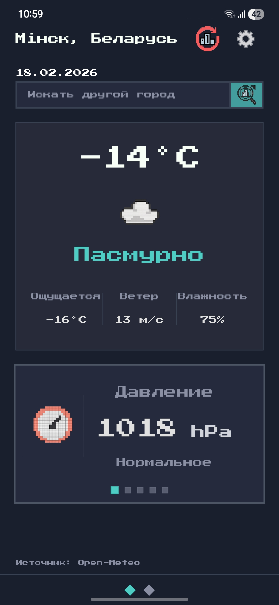
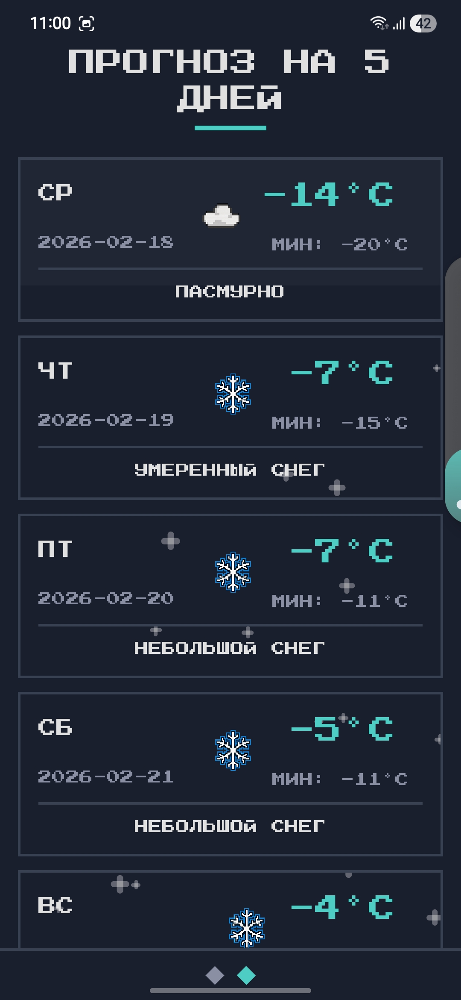
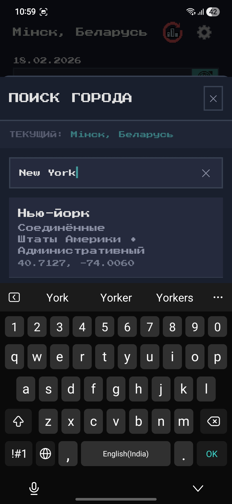
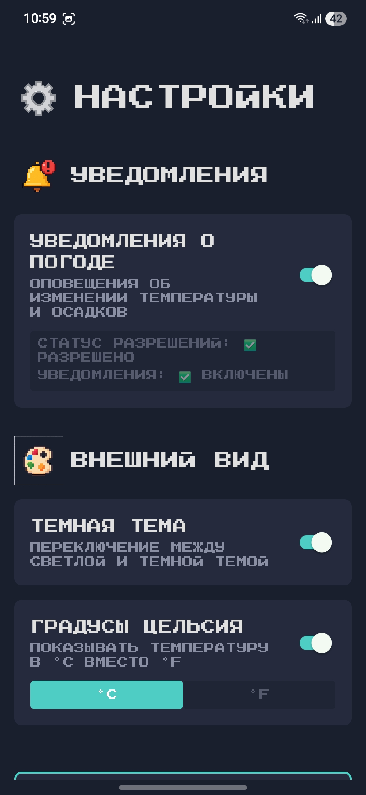

# 🌤️ Pixel Weather

My first React Native app with **real‑world push notifications**, server‑side logic, and a retro pixel aesthetic.  
What started as "let's add notifications" turned into a full‑stack project with a smart backend and a clean frontend.

## 📸 Screenshots

 

  
  
  
  

## ✨ Features

### 🌦️ Weather
- Current weather based on geolocation
- 5‑day forecast (max/min temp, weather codes)
- Detailed metrics: feels like, humidity, pressure, visibility, UV index, wind speed
- City search with last selected city saved

### 🔔 Smart Push Notifications
Notifications are sent **only when the weather actually changes** — no spam.

**What triggers a notification:**
- 🌡️ **Temperature change of ±5°C within 30 minutes**
- ☁️ **Weather type change** (sunny → cloudy → rain → snow)
- 💨 **Strong wind** (>25 m/s)
- ⚡ **Thunderstorm**, 🌫️ **dense fog**, ❄️ **blizzard**
- 🚨 **Emergency events** (hurricane, heavy rain) with high‑priority Android channels

### 🧠 Server‑Side Detection
- Weather changes are detected **on the server** (Vercel + Redis)
- Client only sends push token and coordinates
- CRON job checks weather every 30 minutes
- **Full logging** — you always see why a notification was (or wasn't) sent

### 🔁 Dual API with Fallback
- Primary: [Open‑Meteo](https://open-meteo.com) (no API key required)
- Fallback: [WeatherAPI.com](https://weatherapi.com) (requires key)
- Smart caching: 30 min fresh data, 6 h stale data as last resort

### 🎨 Pixel‑Styled UI
- Retro font (Press Start 2P)
- Dark theme by default
- Fully responsive
- Source badge: shows whether data comes from Open‑Meteo, WeatherAPI, or cache

---

## 🛠️ Tech Stack

**Client (React Native + Expo)**
- React Native / Expo SDK (currently 52)
- NativeWind (Tailwind for RN)
- React Context API + custom hooks
- Expo Router (file‑based navigation)
- TypeScript

**Server (Vercel)**
- Node.js
- Vercel KV (Redis) — stores tokens and weather snapshots
- Expo Server SDK — sends push notifications
- cron‑job.org — wakes the server every 30 minutes

---

## ☁️ Server Repository

The backend lives separately:  
👉 **[pixel-weather-server](https://github.com/Increation-on/pixel-weather-server)**

**Environment variables:**
- `WEATHERAPI_KEY` — fallback API key (optional)
- `KV_*` — automatically provided by Vercel

---

## 📲 Download APK

Latest stable Android build:

👉 **[Download Pixel Weather APK](https://expo.dev/artifacts/eas/73KTdbZeUctN9BFtEUw7ZU.apk)**

**Installation:**
1. Download the APK on your Android device
2. Allow installation from unknown sources (Settings → Security)
3. Open the file and tap "Install"

---

## 🧠 What I Learned

- React Native + Expo from scratch
- Push notifications with server‑side logic
- Background processing on Android
- Vercel + Redis for real‑time data
- Dual API fallback and smart caching
- Building and signing APKs (EAS, keystore, ProGuard)
- Writing a custom weather change detector
- Fighting Windows path limit (260 characters) 😅

---

## 🛣️ Roadmap

- [ ] iOS version
- [ ] Home screen widget
- [ ] Statistics screen (min/max, trends)
- [ ] Custom notification frequency settings

---

## 📝 License

MIT © [Increation](https://github.com/Increation-on)

---

## 👤 Author

**Maksim Dudarev**  
GitHub: [@Increation-on](https://github.com/Increation-on)
